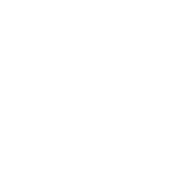
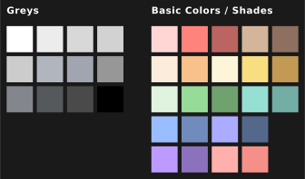

# Introduction

## Requirements

In case you wanna contribute to Delta you need:

- basic knowledge of [`git`](https://git-scm.com/)
- a fork of this repo
- an SVG icon
- an 192x192px PNG icon
- [ComponentInfo](#gathering-componentinfo)(s) of the target app

## Info

We have two methods of adding icons:
  - [Auto method](#auto-method) is a new method of adding icons. You only need to add PNG and SVG to a specific folder and append the icon name with ComponentInfo(s) to a specific YAML file. These files will be automatically handled by our CI/CD every release. 
  - [Manual method](#manual-method) implies editing four XML files and adding icons to two specific folders.

We also have such a thing as alternative icons —  we mainly use it to move an existing icon to an alternative one after rebranding, but there's nothing stopping you to make alternative icons for any app in different shapes as you wish. You can select an alternative icon for the target app via your icon launcher if it supports that feature.

Description of categories and what they are for:

- `New`: for new icons obviously (new icons always must be duplicated there)
- `Alts`: for alternative icons
- `Calendar`: for calendar icons
- `Folders`: for folder icons
- `Google`: for Google apps (Chrome, YouTube, etc.)
- `System`: for system icons (Camera, Settings, etc.)
- `#`: icons whose name starts with a number (or, to be more clear, with an underscore followed by a number, e.g. `_2048`)
- `A-Z`: icons which don't fit in previous categories must be placed in a category based on the first letter of its name

## Rules

- Keep `LF` line endings in files (`CLRF` line endings make GitHub think the entire file has been modified, and they may break our CI/CD)
- SVG, PNG and drawable names must be the same
- Keep filenames in alphanumeric lowercase with underscores
- If the icon name starts with a number, it must have a leading underscore (e.g. `_9gag`) and be placed in `#` category
- Keep the next naming format of alternative icons: `new_icon_alt_x`, where `x` is a number of current alternative version (yes, we have multiple of them, e.g. `old_icon_alt_1`, `old_icon_alt_2`, etc.

# Contributing

> _`new_icon` will be used as the icon name_ <br>
> _`new_icon_alt_1` will be used as the alternative icon for `new_icon`_ <br>
> _`com.example/com.example.MainActivity` will be used as the 1st ComponentInfo for `new_icon`_ <br>
> _`com.example/com.example.StartActivity` will be used as the 2nd ComponentInfo for `new_icon`_

Don't forget to give yourself an entry at the bottom of [`app/src/main/res/xml/contributors.xml`](./app/src/main/res/xml/contributors.xml) if this is your first contribution!

## Auto Method

> **This method is only for adding new icons or linking ComponentInfo(s) with existing icons!** 

1. Add `new_icon.svg` and `new_icon.png` to [`contribs/icons`](./contribs/icons) directory

2. Append the icon name with ComponentInfo(s) to [`contribs/icons.yml`](./contribs/icons.yml) with any of the next formats:

    2.1. The new icon with the ComponentInfo.

    > Can be used for linking the ComponentInfo with the existing icon

    ```yaml
    # lines omitted for example

    new_icon:
        - com.example/com.example.MainActivity
    ```

    2.2. The new icon with multiple ComponentInfos:
    > Can be used for linking ComponentInfos with the existing icon
    ```yaml
    # lines omitted for example

    new_icon:
        - com.example/com.example.MainActivity
        - com.example/com.example.StartActivity
    ```

    Also you can extended the entry for more options. For example, if your icon named as `pixel_buds` but you want it to go in `Google` category. All available options are described in the example below (more options will appear over time):

    ```yaml
    new_icon:
      category: 'N'
      compinfos:
        - com.example/com.example.MainActivity
        - com.example/com.example.StartActivity
    ```

    2.3. The icon without the ComponentInfo (the alternative icon):

    ```yaml
    # lines omitted for example

    new_icon_alt_1: {}
    ```

And we're done! Repeat the process for adding new icons.

## Manual Method

1. Add `new_icon.svg` to [`resources/vectors`](./resources/vectors) directory

2. Add `new_icon.png` to [`app/src/main/res/drawable-nodpi`](./app/src/main/res/drawable-nodpi)

3. Append the line `<item drawable="new_icon" />` in `New` and named categories (the named category is based on the first letter of the icon name; `N` in our case) to [`app/src/main/assets/drawable.xml`](./app/src/main/assets/drawable.xml) and [`app/src/main/res/xml/drawable.xml`](./app/src/main/res/xml/drawable.xml). How it should look:

    ```xml
        <!-- lines omitted -->
        <category title="New" />
        <!-- lines omitted -->
        <item drawable="latest_entry">
        <item drawable="new_icon" />
        
        <category title="Alts" />
        <!-- lines omitted -->

        <category title="N" />
        <!-- lines omitted -->
        <item drawable="latest_entry">
        <item drawable="new_icon" />
        
        <category title="O" />
        <!-- lines omitted -->
    ```
    > You can edit one file and overwrite another with it to keep them identical.

4. Append the line `<item component="ComponentInfo{com.example/com.example.MainActivity}" drawable="new_icon" />` to  [`app/src/main/assets/appfilter.xml`](./app/src/main/assets/appfilter.xml) and [`app/src/main/res/xml/appfilter.xml`](./app/src/main/res/xml/appfilter.xml). How it should look:

    ```xml
        <!-- lines omitted -->
        <item component="ComponentInfo{com.google/com.google.MainActivity}" drawable="latest_entry" />
        <item component="ComponentInfo{com.example/com.example.MainActivity}" drawable="new_icon" />
    </resources>
    ```
    > You can edit one file and overwrite another with it to keep them identical.

The end. More complicated than Auto method, but it's a base method, you can modify/fix current icons by this method.

## Other Cases

### Alternative Icons

If the existing icon rebranded, don't overwrite it with a new one, do the following:

> `old_icon` will be used as an existing icon name

> `old_icon_alt_1` will be used as an alternative icon name for the existing icon name

1. Determine if alternative icons exist for the target app by checking `Alts` category in [`app/src/main/res/xml/drawable.xml`](./app/src/main/res/xml/drawable.xml). If no alternative icons then start numbering from `1` (e.g. `old_icon_alt_1`), otherwise continue numbering based on latest alternative icon number (e.g. `old_icon_alt_2`)

2. Rename `old_icon.svg` to `old_icon_alt_1.svg` in [`resources/vectors`](./resources/vectors) directory (if SVG not found there just skip this step)

3. Rename `old_icon.png` to `old_icon_alt_1.png` in [`app/src/main/res/drawable-nodpi`](./app/src/main/res/drawable-nodpi) directory

4. Add `old_icon_alt_1` to `Alts` category and `old_icon` to `New` category in [`app/src/main/assets/drawable.xml`](./app/src/main/assets/drawable.xml) and [`app/src/main/res/xml/drawable.xml`](./app/src/main/res/xml/drawable.xml)

5. If the ComponentInfo also changed after rebranding, replace `old_icon` with `old_icon_alt_1` in [`app/src/main/assets/appfilter.xml`](./app/src/main/assets/appfilter.xml) and [`app/src/main/res/xml/appfilter.xml`](./app/src/main/res/xml/appfilter.xml) (the alternative icon will be linked with the old ComponentInfos for back compability)

# Resources

## Font

> If the original icon consists of just one or two letters, you may trace that letter instead of using these fonts

- [Now](https://www.1001fonts.com/now-font.html?text=Delta%20Icons) (Sans-serif) — <u>main font</u>; use Now Alt from the same family for alternate lowercase 'a' letter
- [Aleo](https://www.1001fonts.com/aleo-font.html?text=Delta%20Icons) (Serif) — use it only when Serif is needed

## Requests

If you wanna help close icon requests from users, you can take a look at [`contribs/requests.yml`](./contribs/requests.yml) where all requests are stored. The file updates periodically.

## Gathering ComponentInfo

ComponentInfo is what your launcher uses to know which apps get which icons in our icon pack.

You may use these tools to find each app's СomponentInfo(s):
- [Icon Pusher](https://iconpusher.com/) by [V01D](https://v01d.uk)
- [Icon Request](https://github.com/Kaiserdragon2/IconRequest/releases) by [Kaiserdragon2](https://github.com/Kaiserdragon2)

## Icon Template

### Rules

- Canvas size must be 192x192px, the icon size according to the template below
- If the original logo doesn't contain small details or doesn't make up most of the background layer (circle/square/etc.) as designed, keep the logo size between 73-80px
- The rounded corners of squares and rectangles have a corner radius of 10px

|||
|---|---|

Or you can check [Figma icon template](https://www.figma.com/design/02aiFRSLkikcw8mpBAnoDA/Delta-Icon-Template?m=auto&t=qyLH05AMDzZwAI2s-1).

## Colors

### Rules 

- [ <span>$\textcolor{#56595B}{\textsf{⬤}}$ <code>#56595B</code> <i>Davy's grey</i></span> ] as default Black

- [ <span>$\textcolor{#FF837D}{\textsf{⬤}}$ <code>#FF837D</code> <i>Coral pink</i></span> ] as default Red and [ <span>$\textcolor{#BA6561}{\textsf{⬤}}$ <code>#BA6561</code> <i>Fuzzy Wuzzy</i></span> ] as default Dark Red. Shades of Red are specifically for shading purposes

- Transparencies — White (25%, 50%, 70%) and Black (15%, 25%) can be used as overlay for additional shading

### Palette

> Palette variants are hidden under spoilers below

<details>
  <summary>Full</summary>
  <br>
  
</details>

<details>
  <summary>Simple</summary>
  <br>
  <center></center>
</details>

<details>
<summary>HTML</summary>
  <br>
  <table>
    <thead>
      <tr>
      <th>Greys</th>
      <th>Basic</th>
      <th>Reds</th>
      <th>Skintones</th>
      </tr>
    </thead>
    <tbody>
      <tr>
        <td valign="top">
          <p>$\textcolor{#FFFFFF}{\textsf{⬤}}$ <code>#FFFFFF</code> <i>White</i></p>
          <p>$\textcolor{#ECECEC}{\textsf{⬤}}$ <code>#ECECEC</code> <i>Isabelline</i></p>
          <p>$\textcolor{#D8D8D8}{\textsf{⬤}}$ <code>#D8D8D8</code> <i>Timberwolf</i></p>
          <p>$\textcolor{#D2D2D2}{\textsf{⬤}}$ <code>#D2D2D2</code> <i>Light gray</i></p>
          <p>$\textcolor{#CCCCCC}{\textsf{⬤}}$ <code>#CCCCCC</code> <i>Pastel gray</i></p>
          <p>$\textcolor{#B1B5BD}{\textsf{⬤}}$ <code>#B1B5BD</code> <i>Ash grey</i></p>
          <p>$\textcolor{#A0A5AF}{\textsf{⬤}}$ <code>#A0A5AF</code> <i>Dark gray</i></p>
          <p>$\textcolor{#979797}{\textsf{⬤}}$ <code>#979797</code> <i>Manatee</i></p>
          <p>$\textcolor{#83868C}{\textsf{⬤}}$ <code>#83868C</code> <i>Taupe gray</i></p>
          <p>$\textcolor{#56595B}{\textsf{⬤}}$ <code>#56595B</code> <i>Davy's grey</i></p>
          <p>$\textcolor{#4A4A4A}{\textsf{⬤}}$ <code>#4A4A4A</code> <i>Quartz</i></p>
          <p>$\textcolor{#000000}{\textsf{⬤}}$ <code>#000000</code> <i>Black</i></p>
        </td>
        <td valign="top">
          <p>$\textcolor{#FFD6D4}{\textsf{⬤}}$ <code>#FFD6D4</code> <i>Pastel pink</i></p>
          <p>$\textcolor{#FF837D}{\textsf{⬤}}$ <code>#FF837D</code> <i>Coral pink</i></p>
          <p>$\textcolor{#BA6561}{\textsf{⬤}}$ <code>#BA6561</code> <i>Fuzzy Wuzzy</i></p>
          <p>$\textcolor{#D3B69A}{\textsf{⬤}}$ <code>#D3B69A</code> <i>Tan</i></p>
          <p>$\textcolor{#8E6F60}{\textsf{⬤}}$ <code>#8E6F60</code> <i>Shadow</i></p>
          <p>$\textcolor{#FCECDC}{\textsf{⬤}}$ <code>#FCECDC</code> <i>Antique white</i></p>
          <p>$\textcolor{#F8C18C}{\textsf{⬤}}$ <code>#F8C18C</code> <i>Pale gold</i></p>
          <p>$\textcolor{#FDF5D9}{\textsf{⬤}}$ <code>#FDF5D9</code> <i>Cornsilk</i></p>
          <p>$\textcolor{#F9DE81}{\textsf{⬤}}$ <code>#F9DE81</code> <i>Jasmine</i></p>
          <p>$\textcolor{#C39A54}{\textsf{⬤}}$ <code>#C39A54</code> <i>Camel</i></p>
          <p>$\textcolor{#E0F4E0}{\textsf{⬤}}$ <code>#E0F4E0</code> <i>Platinum</i></p>
          <p>$\textcolor{#98DC9A}{\textsf{⬤}}$ <code>#98DC9A</code> <i>Granny Smith Apple</i></p>
          <p>$\textcolor{#71A372}{\textsf{⬤}}$ <code>#71A372</code> <i>Asparagus</i></p>
          <p>$\textcolor{#96DFD3}{\textsf{⬤}}$ <code>#96DFD3</code> <i>Pale robin egg blue</i></p>
          <p>$\textcolor{#73ADA4}{\textsf{⬤}}$ <code>#73ADA4</code> <i>Cadet blue</i></p>
          <p>$\textcolor{#9ABEFF}{\textsf{⬤}}$ <code>#9ABEFF</code> <i>Baby blue eyes</i></p>
          <p>$\textcolor{#728DBE}{\textsf{⬤}}$ <code>#728DBE</code> <i>Dark pastel blue</i></p>
          <p>$\textcolor{#54688C}{\textsf{⬤}}$ <code>#54688C</code> <i>UCLA Blue</i></p>
          <p>$\textcolor{#ABABFF}{\textsf{⬤}}$ <code>#ABABFF</code> <i>Baby blue eyes</i></p>
          <p>$\textcolor{#BD9AFF}{\textsf{⬤}}$ <code>#BD9AFF</code> <i>Bright lavender</i></p>
          <p>$\textcolor{#8C72BD}{\textsf{⬤}}$ <code>#8C72BD</code> <i>Ube</i></p>
        </td>
        <td valign="top">
          <p>$\textcolor{#FFB0AC}{\textsf{⬤}}$ <code>#FFB0AC</code> <i>Melon</i></p>
          <p>$\textcolor{#F58F8A}{\textsf{⬤}}$ <code>#F58F8A</code> <i>Light coral</i></p>
          <p>$\textcolor{#F4806D}{\textsf{⬤}}$ <code>#F4806D</code> <i>Coral pink</i></p>
          <p>$\textcolor{#E85E5C}{\textsf{⬤}}$ <code>#E85E5C</code> <i>Terra cotta</i></p>
          <p>$\textcolor{#DC505E}{\textsf{⬤}}$ <code>#DC505E</code> <i>Dark terra cotta</i></p>
          <p>$\textcolor{#B02A3C}{\textsf{⬤}}$ <code>#B02A3C</code> <i>Deep carmine</i></p>
          <p>$\textcolor{#7A1B1C}{\textsf{⬤}}$ <code>#7A1B1C</code> <i>Falu red</i></p>
          <p>$\textcolor{#511119}{\textsf{⬤}}$ <code>#511119</code> <i>Dark scarlet</i></p>
        </td>
        <td valign="top">
          <p>$\textcolor{#F1E9E0}{\textsf{⬤}}$ <code>#F1E9E0</code> <i>Eggshell</i></p>
          <p>$\textcolor{#D6C8BA}{\textsf{⬤}}$ <code>#D6C8BA</code> <i>Pastel gray</i></p>
          <p>$\textcolor{#D4C6B8}{\textsf{⬤}}$ <code>#D4C6B8</code> <i>Pale silver</i></p>
          <p>$\textcolor{#D7D0B8}{\textsf{⬤}}$ <code>#D7D0B8</code> <i>Pastel gray</i></p>
          <p>$\textcolor{#E2C9B0}{\textsf{⬤}}$ <code>#E2C9B0</code> <i>Desert sand</i></p>
          <p>$\textcolor{#D4B79A}{\textsf{⬤}}$ <code>#D4B79A</code> <i>Tan</i></p>
          <p>$\textcolor{#BF9E73}{\textsf{⬤}}$ <code>#BF9E73</code> <i>Camel</i></p>
        </td>
      </tr>
    </tbody>
  </table>
</details>

#### Graphic Editors

- [Adobe Swatch Exchange Palette](./resources/palettes/palette.ase) (Illustrator, Photoshop)

- [GPL Pallete](./resources/palettes/palette.gpl) (Inkscape, Karbon)

# Building via GitHub Actions

> Everything described here must be done in your fork

## Creating Secrets

Go to `Settings → Secrets and Variables → Actions` and create the following repository secrets:

  - `KEYSTORE_BASE64`

    ```
    MIIKRgIBAzCCCfAGCSqGSIb3DQEHAaCCCeEEggndMIIJ2TCCBbAGCSqGSIb3DQEHAaCCBaEEggWdMIIFmTCCBZUGCyqGSIb3DQEMCgECoIIFQDCCBTwwZgYJKoZIhvcNAQUNMFkwOAYJKoZIhvcNAQUMMCsEFALf2o/enYgJaO2D4otoTSpxWhWtAgInEAIBIDAMBggqhkiG9w0CCQUAMB0GCWCGSAFlAwQBKgQQMpyd3LX1rnoCfCGv+LAQ1wSCBNDoQdq5T9uFBEf2nKKgH1WR1/F7s9AIk9Gs+VVu03Y8ntd7QNDf55HytKZbRFE5cN7Vod5LPm4uiUP5zPVkGgqmX6nfZPRppR1k17X2pYG/lm7n2WUItt35HeIxr6Tbnqr7eLRuCwCZ7kfpJYhmOVZ/MIsylejqjbTqX1ajkVUFeb4J0KVZlq4OXhqMCmHHxaZe41yV/WjfPtbXyP7MCjp47XY4LpTlJ+ad1COwlktMv1oud5UUQfVnQwkcOQZQGoZuuL41cEAeHjR6GpEVnyhR33t9kOPdAPLFVyp22+8TLFt3RlRvJy4Sn+430kxGxhrfW8KTfz0CiGljTeElTq55OscEi+eOLJo/gwVgZ7zas+7lV/4MAhcQLsArhCn5v1l1QVWeXE+9udME+0OZfc3A/TDeP1k40/1KVkFpmKLyH1DZlCLy5SeuANFtKpP+Uj3tioVI7CBHzuTkf2A4itoaVHOFELmK7O5ypfz8jL+qmwQjvJiPJoVdCNZPUr9zF6uym65BvtRwBWhBKiBNYYCoeXJkX46SGSgZ4nSIlBGq3DwGbTqG6JfJkzbIys5a5nCIQWwCalveIRDeYQlEorNWXGY37cF1TOeCWcS6NeTSpAP+Php27kUpAwkYYTVJcqWnOyXcDysxiD1AWWt8Jtpg00OBnHVD1ANgoa8Zfe12pBEXIaLh/3PoBTkcHii0WRhV88z0ewGKTWKTYKFTJAY/pkP4MfPePYuJPvt3FZJ2NnslocTi8JgWZcveBsPNFSjTpR1aapg+ukgYRwAYO69gH2tw4SBkozrRTwh86xmedLA8ah1Jii7itdUg+odmF+JUjm2X50BJiLCpUKJxnJ4zkkcB7DP7XlRNHz/KBg5WLbNyBPxB6LYQbtMUDQ6Du0Idl5vQ/HLgbs1wHUMFQA/uc9Czz43Ansh1g+ZGI7pw+RVUGKe3YglXjrbGe8RWlr3RxjxBnWExeMkg9Z3SDVRYkFOQ8aI5HB/37JFAG5tk/z7UxiM1GlnEA3ZCZ/OJJMaYYfFidIsNb8FVjWddOPfDmrJlguSilkqJx2VsGAxslSpcicCHRij/Rjm5E6wWkj7GjgJb9kf4kXbOi+THK09/40LqZci89qvUJ1a0a0Ts+IVOhaIXXAk/1Jd2zzFTU/yRSPjm5UvLkajhfmr7sR/XCjZN53kq8aR6F5YIyH1f+Su3ahzl4CGG7Dceypd5KX0NfpO2i/9IoYSDTm/eWCNfQ18k7kpqdI/tyhD1YTum2dzW8o578qReph37SG5CsqX9AVeuKBLihAbY+fZ4tKaWigiigCgnGBKjKcBNRTjnDlfL/lkmR0uB6Ye618dnRVUIOsfG9rsM0pLlNc2rUIBwEkFXj7Zdsao9y3T+SCIBNyM0mWEleQLHcEs8E8g7C88gtvFvxXGANT3z1tr0C05Og9OJSV7Sz4Di7JoI+c1kmBS7Gn8KqxYNv+lCdS0f+mKIypOHwgRcPeY7rk0vpkfBHIaMR8Vnvd0aiOCgbmiJWXTcmfl+cgKUvcfzMUbR8aYJPnP0wEUR64EBuEJHUnkwpFUprXDYvIPcI39EALVlnVqY5ZSXzeqX2vVyiuK4IcR6R7vH0ZlD26r0/c/Pj3Ci6mQS6RNGuzrcsf78/bvdzTFCMB0GCSqGSIb3DQEJFDEQHg4AYQBuAGQAcgBvAGkAZDAhBgkqhkiG9w0BCRUxFAQSVGltZSAxNjgzNTMxNDQ1NzI0MIIEIQYJKoZIhvcNAQcGoIIEEjCCBA4CAQAwggQHBgkqhkiG9w0BBwEwZgYJKoZIhvcNAQUNMFkwOAYJKoZIhvcNAQUMMCsEFAMBu3VzOPYst5nuc5pukUGrNpb1AgInEAIBIDAMBggqhkiG9w0CCQUAMB0GCWCGSAFlAwQBKgQQjKOpjsq0gFHwTwH9VV53BoCCA5DBfuD14myPSgcezH6Z4V2Fph94upgzY4ijij5zOZdgzj4D7yYbNh9iSSvb3nEB5m/FbnuHBYuGEzeGOiHugMqPwr+2M4dfqcC+17myjtv+2DCseUHZIMAA++HBWsl1yFF8OF7Ofxj8f17gBiJ+Cexd1oniNj8HyT5aWeJ/+pIsMSirX/fQ2sKyA7YTrmFVAqsJ29rTv923XDXi1CcW0tGsxFHT+FsbvwzxS5S2t8hKgmbQz2tO6i/NP6kencEc93YdsVRVlO+pu8bT+LXSvINT1wdrsedWlUBIjjmEfuz6cckDIpphsaEQcMegTJ0eb5IldyrCD7iVTWYBE6ZhUM9v7UbAAEx3MsdMOfsdNqpfFeJswIYOxQjBJ0GFv7zVfVT6LA2SXqwTaecFiAl5pC3QOFOsSSe/rndBqeT62zGn9daL4Zr1qgmhtvFcgOYKAVGgxiaa2XDN6Z8OsIgYqONWOhwX8IwjbWgpiVzJjr9HqNSrUl+3Fk8nOyzRlf1gBdQmIblDqZ9C6PPHSJQiVZCS8hd68np9oiz96ltxSnroEZ7YkoBQSfDMw3nFoDJ6W46/H65HjUmALxikw1wsOkDvT5Z6VGvaAHFc7Ng/38UBx1yNhF+W+IGFnXIhtwaxfKmdtdFjHzS54Q5qPk/HCKVBTlZOZtfEJvQNiE1pthDMPwdYZ8a6PR7gTEiRT9LChHuGh1TZIhk0rkGiUJScj5ix69iGHTi4yKmeHgqonDXeCCdyjf6S9Ox8wQ7x9Kvu53pz8u/hadbR/+Iuc9v1YFES44QmApizYYEUufVCYqlsCD+pBSm41WSpvLYZvBJpO8lQgMPNh+IKU5mbTaMOdF+NMRMdu1tdjBbcjn/HpqCIztNxZqUbcRe4ndNMs7qmDdIDqmkPBxmLnmuJERHNdu2BiCsj+UlVDgVx0H7yNFFAD7RPheekIHMILhb63ngr1uKXYD/zpJj3fNqbOlveN47JydA1pEMPRKmehudmgm5k9oNxgKKDof3J9RMsynUSNUlvG/UWA/9+aeL8vImOMSeYAnQ3idwc8t4y9zzHWmVzdtw9vALo8O5H1IddwSlii4U9kq/3NniWR7JaPEva910vOYDlkcSIoZyLuEx3e+QgYVlI/9u0/0cE0PzwY8BAJK0ze38Rz5pRfErenYRQ/xXZ8uKM4gJZ5C8bYj3RN8yFFs5UL6gbeacaWVrjVPuW+zswTTAxMA0GCWCGSAFlAwQCAQUABCCoXbCueJPh7HqJ7mXzLBbkWP2C3n/PcJd94KJX2rufDQQUn9KR4oRYNugnRaGiJGcSzwEvq7oCAicQ
    ```
  - `KEYSTORE_PASSWORD`

    ```
    android
    ```

  - `KEYSTORE_KEY_ALIAS`

    ```
    android
    ```

  - `KEYSTORE_KEY_PASSWORD`

    ```
    android
    ```

You can generate a new keystore with `keytool -genkeypair -alias android -keypass android -keystore android.keystore -storepass android -keyalg RSA -dname "CN=Android,O=Android,C=US" -validity 9999` and fill secrets with your values.

To encode the keystore, use `cat android.keystore | base64 | tr -d '\n' > android.keystore.base64` or do it with any online tool.

## Run Workflow

1. Go to **Actions**
2. Select **Build FOSS**
3. Select **Run workflow** then click to green **Run workflow** button
4. Wait for the build, it takes approximately 5 minutes

The zipped APK will be attached to the workflow run. Go to **Actions**, click on the latest workflow run and download it from **Artifacts** down below
