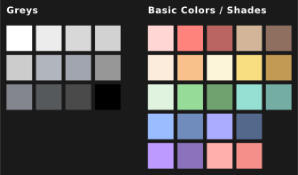
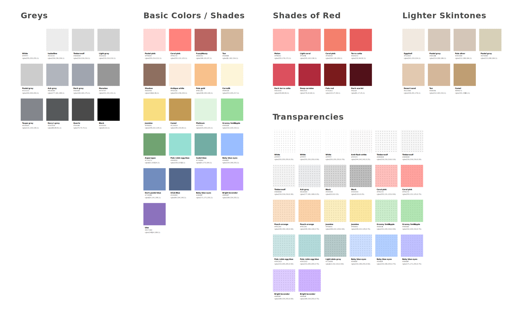

# ℹ️ Introduction

> Feel free to ask for help on [the Discord server](https://discord.gg/F9RFqHN) if something is unclear

Hello! I see you've decided to contribute. Well, there are a few ways to go:

If you know how to make cool icons but don't know how to work with [git](https://git-scm.com/), [GitHub](https://github.com), and other tech stuff, just read [Design Guidelines](#-design-guidelines) carefully, then make some icons and submit them on Discord.

If you don't know how to make cool icons but you are tech-savvy, you can help improve our CI/CD, add missing ComponentInfos, and do other things. Read [Contributing](#-contributing) for more info.

If you can handle tech and design stuff, then read this guide completely.

If you don't know any of that but want to try to make icons... well, we can only help with advice on Discord. There are so many tools, instructions, and guides for them that it’s impossible to describe everything, so the only thing you can do is search for information on the Internet and try it out.

In short, the general requirements are:

- Basic knowledge of [git](https://git-scm.com/) and/or [GitHub](https://github.com).
- Experience with vector editors.
- A little bit of design sense. 😂

Good luck!

# 📝 Design Guidelines

## 🪄 General Tips

- Keep it simple: fewer details and small elements, because they may not be visible on the screen.
- Your icon doesn't have to be a 1:1 copy of the original; improve and simplify it in every way possible but at the same time try to maintain a recognizable appearance.
- Avoid outlining, otherwise the icon will stand out from the general style.
- Make the icon free-form if possible.
- You can search for app logos online (they're often found on official websites; avoid icons with non-free licenses) and adapt them. If the original icon is too complex, you can use another recognizable element (an item, a faction icon, etc.) — this applies to any complex icon, not just games.
- Be sure to double-check that icons are centered and aligned, sized and exported correctly.

## 🖼️ Icon Template

### 📐 Rules

- Canvas size must be 192x192px. The template from [Resources](#-resources) is correctly configured, just download and work with it.
- The icon size does not exceed template dimensions. Check out [the visual explanation](./resources/templates/template_tutorial.svg).
- If the original logo is simple and doesn't fill most of the template as a shape (circle, square, etc.), keep the logo size between 73–80px.
- The rounded corners of squares and rectangles have a corner radius of 10px.
- The template must be properly centered on the canvas.

### 🪄 Tips

- If you're having trouble deciding whether to use geometric or optical centering, you can discuss it on Discord. Mostly it depends on the icon, but optical centering is usually your choice.
- If you have any doubts about the design of your icon, you can also discuss it on Discord.

### 🧰 Resources

> You can also check [Figma icon template](https://www.figma.com/design/02aiFRSLkikcw8mpBAnoDA/Delta-Icon-Template?m=auto&t=qyLH05AMDzZwAI2s-1).


## 🌈 Colors

### 📐 Rules

- <span>$\textcolor{#56595B}{\textsf{⬤}}$ <code>#56595B</code> <b>Davy's grey</b></span> as default black.

- <span>$\textcolor{#FF837D}{\textsf{⬤}}$ <code>#FF837D</code> <b>Coral pink</b></span> as default red and <span>$\textcolor{#BA6561}{\textsf{⬤}}$ <code>#BA6561</code> <b>Fuzzy Wuzzy</b></span> as default dark red. Shades of red are specifically for shading purposes.

- Transparencies can be used as an overlay for additional shading. We rarely use them, so don't use them unnecessarily — try to get by with basic colors and greys as much as possible. If you do use transparency, it should be an overlay, never a background (i.e. no transparency in the raster version).

- Gradients are more acceptable than transparencies, but still try to avoid using them (as noted above).

### 🎨 Palette

<table>
  <thead>
    <tr>
    <th>Greys</th>
    <th>Basic</th>
    <th>Reds</th>
    <th>Skintones</th>
    </tr>
  </thead>
  <tbody>
    <tr>
      <td valign="top">
        <p>$\textcolor{#FFFFFF}{\textsf{⬤}}$ <code>#FFFFFF</code> <i>White</i></p>
        <p>$\textcolor{#ECECEC}{\textsf{⬤}}$ <code>#ECECEC</code> <i>Isabelline</i></p>
        <p>$\textcolor{#D8D8D8}{\textsf{⬤}}$ <code>#D8D8D8</code> <i>Timberwolf</i></p>
        <p>$\textcolor{#D2D2D2}{\textsf{⬤}}$ <code>#D2D2D2</code> <i>Light gray</i></p>
        <p>$\textcolor{#CCCCCC}{\textsf{⬤}}$ <code>#CCCCCC</code> <i>Pastel gray</i></p>
        <p>$\textcolor{#B1B5BD}{\textsf{⬤}}$ <code>#B1B5BD</code> <i>Ash grey</i></p>
        <p>$\textcolor{#A0A5AF}{\textsf{⬤}}$ <code>#A0A5AF</code> <i>Dark gray</i></p>
        <p>$\textcolor{#979797}{\textsf{⬤}}$ <code>#979797</code> <i>Manatee</i></p>
        <p>$\textcolor{#83868C}{\textsf{⬤}}$ <code>#83868C</code> <i>Taupe gray</i></p>
        <p>$\textcolor{#56595B}{\textsf{⬤}}$ <code>#56595B</code> <i>Davy's grey</i></p>
        <p>$\textcolor{#4A4A4A}{\textsf{⬤}}$ <code>#4A4A4A</code> <i>Quartz</i></p>
        <p>$\textcolor{#000000}{\textsf{⬤}}$ <code>#000000</code> <i>Black</i></p>
      </td>
      <td valign="top">
        <p>$\textcolor{#FFD6D4}{\textsf{⬤}}$ <code>#FFD6D4</code> <i>Pastel pink</i></p>
        <p>$\textcolor{#FF837D}{\textsf{⬤}}$ <code>#FF837D</code> <i>Coral pink</i></p>
        <p>$\textcolor{#BA6561}{\textsf{⬤}}$ <code>#BA6561</code> <i>Fuzzy Wuzzy</i></p>
        <p>$\textcolor{#D3B69A}{\textsf{⬤}}$ <code>#D3B69A</code> <i>Tan</i></p>
        <p>$\textcolor{#8E6F60}{\textsf{⬤}}$ <code>#8E6F60</code> <i>Shadow</i></p>
        <p>$\textcolor{#FCECDC}{\textsf{⬤}}$ <code>#FCECDC</code> <i>Antique white</i></p>
        <p>$\textcolor{#F8C18C}{\textsf{⬤}}$ <code>#F8C18C</code> <i>Pale gold</i></p>
        <p>$\textcolor{#FDF5D9}{\textsf{⬤}}$ <code>#FDF5D9</code> <i>Cornsilk</i></p>
        <p>$\textcolor{#F9DE81}{\textsf{⬤}}$ <code>#F9DE81</code> <i>Jasmine</i></p>
        <p>$\textcolor{#C39A54}{\textsf{⬤}}$ <code>#C39A54</code> <i>Camel</i></p>
        <p>$\textcolor{#E0F4E0}{\textsf{⬤}}$ <code>#E0F4E0</code> <i>Platinum</i></p>
        <p>$\textcolor{#98DC9A}{\textsf{⬤}}$ <code>#98DC9A</code> <i>Granny Smith Apple</i></p>
        <p>$\textcolor{#71A372}{\textsf{⬤}}$ <code>#71A372</code> <i>Asparagus</i></p>
        <p>$\textcolor{#96DFD3}{\textsf{⬤}}$ <code>#96DFD3</code> <i>Pale robin egg blue</i></p>
        <p>$\textcolor{#73ADA4}{\textsf{⬤}}$ <code>#73ADA4</code> <i>Cadet blue</i></p>
        <p>$\textcolor{#9ABEFF}{\textsf{⬤}}$ <code>#9ABEFF</code> <i>Baby blue eyes</i></p>
        <p>$\textcolor{#728DBE}{\textsf{⬤}}$ <code>#728DBE</code> <i>Dark pastel blue</i></p>
        <p>$\textcolor{#54688C}{\textsf{⬤}}$ <code>#54688C</code> <i>UCLA Blue</i></p>
        <p>$\textcolor{#ABABFF}{\textsf{⬤}}$ <code>#ABABFF</code> <i>Baby blue eyes</i></p>
        <p>$\textcolor{#BD9AFF}{\textsf{⬤}}$ <code>#BD9AFF</code> <i>Bright lavender</i></p>
        <p>$\textcolor{#8C72BD}{\textsf{⬤}}$ <code>#8C72BD</code> <i>Ube</i></p>
      </td>
      <td valign="top">
        <p>$\textcolor{#FFB0AC}{\textsf{⬤}}$ <code>#FFB0AC</code> <i>Melon</i></p>
        <p>$\textcolor{#F58F8A}{\textsf{⬤}}$ <code>#F58F8A</code> <i>Light coral</i></p>
        <p>$\textcolor{#F4806D}{\textsf{⬤}}$ <code>#F4806D</code> <i>Coral pink</i></p>
        <p>$\textcolor{#E85E5C}{\textsf{⬤}}$ <code>#E85E5C</code> <i>Terra cotta</i></p>
        <p>$\textcolor{#DC505E}{\textsf{⬤}}$ <code>#DC505E</code> <i>Dark terra cotta</i></p>
        <p>$\textcolor{#B02A3C}{\textsf{⬤}}$ <code>#B02A3C</code> <i>Deep carmine</i></p>
        <p>$\textcolor{#7A1B1C}{\textsf{⬤}}$ <code>#7A1B1C</code> <i>Falu red</i></p>
        <p>$\textcolor{#511119}{\textsf{⬤}}$ <code>#511119</code> <i>Dark scarlet</i></p>
      </td>
      <td valign="top">
        <p>$\textcolor{#F1E9E0}{\textsf{⬤}}$ <code>#F1E9E0</code> <i>Eggshell</i></p>
        <p>$\textcolor{#D6C8BA}{\textsf{⬤}}$ <code>#D6C8BA</code> <i>Pastel gray</i></p>
        <p>$\textcolor{#D4C6B8}{\textsf{⬤}}$ <code>#D4C6B8</code> <i>Pale silver</i></p>
        <p>$\textcolor{#D7D0B8}{\textsf{⬤}}$ <code>#D7D0B8</code> <i>Pastel gray</i></p>
        <p>$\textcolor{#E2C9B0}{\textsf{⬤}}$ <code>#E2C9B0</code> <i>Desert sand</i></p>
        <p>$\textcolor{#D4B79A}{\textsf{⬤}}$ <code>#D4B79A</code> <i>Tan</i></p>
        <p>$\textcolor{#BF9E73}{\textsf{⬤}}$ <code>#BF9E73</code> <i>Camel</i></p>
      </td>
    </tr>
  </tbody>
</table>

### 🧰 Resources

#### Vector Palettes

- <details>
  <summary>Simplified Palette</summary>
  <br>
  <center></center>
</details>

- <details>
  <summary>Full Palette</summary>
  <br>
  
</details>

#### Vector Editors

- [Adobe Swatch Exchange Palette](./resources/palettes/palette.ase) (Illustrator, Photoshop)
- [GPL Palette](./resources/palettes/palette.gpl) (Inkscape, Karbon)

## 🗚 Font

### 🪄 Tips

- If the original icon consists of just one or two letters, you may trace that letter instead of using these fonts.
- Fonts can be a little tricky to align/center in different vector editors, so read about it on the Internet.
- You can use a custom font if it matches the font from the original icon, for the rest use fonts from [Resources](#-resources-2).

### 🧰 Resources

- [Now](https://www.1001fonts.com/now-font.html?text=Delta%20Icons) — main Sans-serif font; use Now Alt from the same family for alternate lowercase 'a' letter.
- [Aleo](https://www.1001fonts.com/aleo-font.html?text=Delta%20Icons) — use it only when Serif is needed.

# 📥 Contributing

## 🪟 Overview

### ❔ Key Terms

> Some things are described very roughly for better understanding.

- **Icon images** — your exported PNG/SVG icons.
- **ComponentInfo** — an app identifier (e.g. `com.example/com.example.MainActivity`) that launchers use to match an installed app to its icon in the icon pack. You can use these tools to get ComponentInfos from your installed apps:

  - [Icon Pusher](https://iconpusher.com/) by [V01D](https://v01d.uk)
  - [Icon Request](https://github.com/Kaiserdragon2/IconRequest/releases) by [Kaiserdragon2](https://github.com/Kaiserdragon2)

- **Drawable name** — an internal name of an icon (e.g. `new_icon`). It's used to include an icon image to the icon pack, and in combo with ComponentInfo(s) it links the icon with the target app. The drawable name must be in alphanumeric lowercase with underscores only and icon image names must match the drawable name exactly (e.g. `new_icon.png` and `new_icon.svg`).
- **Standalone icon** — an icon that isn't linked to any app. They can be non-app icons like `adobe` and be used as web shortcut icons, etc. Users can select them via their launcher if it supports that feature.
- **Alternative icon** — an alternative version of an app icon. Mainly used when the app rebrands: the old icon becomes an alternative (e.g. `new_icon_alt_1`), and a new icon takes its place. However, you can create alternative icons for any app without linking them to any ComponentInfo, and they will be standalone. Users can select them via their launcher if it supports that feature.
- **Categories** — categories within [`app/src/main/assets/drawable.xml`](./app/src/main/assets/drawable.xml) to organize icons. Description of categories:

  - `New` — new icons for the current release. If [manually](#️-manual) adding icons, you must also add the entry to this category.
  - `Alts` — alternative icons.
  - `Calendar` — calendar icons.
  - `Folders` — folder icons.
  - `Google` — Google apps (Chrome, YouTube, etc.).
  - `System` — system icons (Camera, Contacts, Settings, etc.).
  - `#` — icons whose name starts with a number (e.g. `_2048`). If [manually](#️-manual) adding icons, drawable names that begin with a number must have a leading underscore and be placed in this category.
  - `A–Z` — everything else, sorted by the first letter of the drawable name.

### 📐 Rules

- Keep [LF](https://en.wikipedia.org/wiki/Newline) line endings in edited files.

### 🗒️ Notes for Contributors

Want to help close user requests? Check [`contribs/requests.yml`](./contribs/requests.yml) — it contains all pending icon requests and is updated periodically.

If you wish, you can add yourself to [`app/src/main/res/xml/contributors.xml`](./app/src/main/res/xml/contributors.xml) to shine in the app's contributors section!

## 📚 Managing Icons

> `new_icon` (and derivatives of it) will be used as a drawable name<br>
> `com.example/com.example.MainActivity` (and derivatives of it) will be used as a ComponentInfo

So, you made an icon then exported it as `new_icon.png` and `new_icon.svg`. Now you need to select which way to manage icons. Here are two ways:

- [**Auto**](#-auto) — an automatic and declarative way of managing icons via [`contribs/icons.yml`](./contribs/icons.yml), processed by scripts and GitHub Actions. This is the recommended approach.
- [**Manual**](#️-manual) — this is how icons were managed before [**Auto**](#-auto) was implemented. Directly editing XMLs and placing icon images into the appropriate directories. More control, but inconvenient. Try to avoid it unless [**Auto**](#-auto) can't handle what you need.

### 🤖 Auto

This is an automatic and declarative method of managing icons via [`contribs/icons.yml`](./contribs/icons.yml), driven by scripts and GitHub Actions.

Place your icon images in the [`contribs/icons`](./contribs/icons) directory and add the following entry to [`contribs/icons.yml`](./contribs/icons.yml):

```yaml
new_icon: com.example/com.example.MainActivity
```

And that's all. This is the easiest and most common method for adding a new icon and linking it to an app. [`contribs/icons.yml`](./contribs/icons.yml) will be processed by scripts and cleared automatically every release.

That entry can be extended with more options:

```yaml
new_icon:
  action: rewrite
  category: google
  compinfo:
    - com.example/com.example.MainActivity
    - com.example/com.example.SplashActivity
```

Check [Options](#options) to get more explanation of each option and [Examples](#examples) for more examples.

#### Options

- `action` — describes what to do with the icon. It can take one of the following values:

  - `add` — add a new icon. This is the default action if the option is not explicitly set.
  - `rewrite` — overwrite icon images of an existing icon with new ones from [`contribs/icons`](./contribs/icons).
  - `rebrand` — move an existing icon to `alt_x` (`x` will be automatically calculated), add a new icon and use it as the main one. If you pass any ComponentInfo, existing ComponentInfos will be attached to `alt_x` (for backward compatibility with older versions of the app), otherwise `alt_x` will be a standalone alternative icon.
  - `remove` — remove an existing icon.
  - `rename > name` — rename an existing icon (where `name` is a new name of the existing icon).
  - `move > category` — move an existing icon to a different category (where `category` is the category name).

- `category` — overrides the automatic category assignment, e.g. if you want to assign a Google app icon to the Google category. If not set, the category is assigned based on the following logic:

  - if the drawable name starts with `_[0-9]` (e.g. `_2048`), the category will be `#`
  - if the drawable name ends with `_alt_[0-9]+` (e.g. `telegram_alt_23`), the category will be `Alts`
  - else the category will be `A–Z` based on the first letter of the drawable name

- `compinfo` — a list of ComponentInfos to link to the current icon. It can be a string or a list (see more in [Examples](#examples)).

#### Examples
```yaml
# a new icon with a single ComponentInfo
# without adding icon images it will only link a ComponentInfo with new_icon
new_icon: com.example/com.example.MainActivity
# or with multiple ComponentInfos
new_icon:
  - com.example/com.example.MainActivity
  - com.example/com.example.SplashActivity

# new alternative icons
# will be automatically assigned to Alts category
new_icon_alt_1: com.example/com.example.MainActivity
new_icon_alt_2: com.example/com.example.SplashActivity
# or new standalone alternative icons
new_icon_alt_1: {}
new_icon_alt_2: {}
# if you're not sure if there's no alts with these names, you can use this:
#   _alt_x<N> will be automatically resolved to the next available alt number, e.g.:
#     new_icon_alt_x1 > new_icon_alt_4 (if _alt_1, _alt_2, _alt_3 exist)
#   use different numbers after x to add multiple alts in one file
new_icon_alt_x1: com.example/com.example.MainActivity
new_icon_alt_x2: com.example/com.example.SplashActivity
new_icon_alt_x3: {}
new_icon_alt_x4: {}

# a new standalone icon
new_icon: {}

# add a new Google app icon to Google category
google_app:
  category: google

# rewrite the icons of an existing icons without touching XMLs
# existing_icons.png and existing_icon.svg must be in contribs/icons
existing_icon:
  rebrand: rewrite

# rebrand an existing icon and make the previous icon a standalone alternative icon \
# as existing_icon_alt_x (x will be automatically calculated)
existing_icon:
  rebrand: rebrand

# rebrand an existing icon with attaching previous ComponentInfos \
# to a existing_icon_alt_x (x will be automatically calculated)
existing_icon:
  rebrand: rebrand
  compinfos:
    - com.example/com.example.MainActivity

# rename an existing icon
# will be automatically moved to the appropriate category
existing_icon:
  action: rename > new_icon

# move an existing icon to a different category, e.g. google
existing_icon:
  action: move > google

# remove an existing icon from XMLs and image directories
existing_icon:
  action: remove

```

### ✍️ Manual

This is how icons were managed before [**Auto**](#-auto) was implemented. Directly editing XMLs and placing exported icons into the appropriate directories. More control, but inconvenient. Try to avoid it unless [**Auto**](#-auto) can't handle what you need.

There are two `drawable.xml` and two `appfilter.xml` files to edit (stored in [`app/src/main/assets`](./app/src/main/assets) and [`app/src/main/res/xml`](./app/src/main/res/xml)). It's better to edit the XMLs in [`app/src/main/assets`](./app/src/main/assets), then copy them to [`app/src/main/res/xml`](./app/src/main/res/xml) to keep all files identical. You can do it however you want (e.g. editing all files at the same time), just keep them identical.

#### Adding a new icon

1. Add `new_icon.svg` to [`resources/vectors`](./resources/vectors) directory.

2. Add `new_icon.png` to [`app/src/main/res/drawable-nodpi`](./app/src/main/res/drawable-nodpi) directory.

3. Append the line `<item drawable="new_icon" />` to both the `New` and the appropriate letter category in [`app/src/main/assets/drawable.xml`](./app/src/main/assets/drawable.xml). Here's how it should look:

    ```xml
    <!-- lines omitted -->
    <category title="New" />
    <!-- lines omitted -->
    <item drawable="latest_entry" />
    <item drawable="new_icon" />

    <category title="Alts" />
    <!-- lines omitted -->

    <category title="N" />
    <!-- lines omitted -->
    <item drawable="latest_entry" />
    <item drawable="new_icon" />

    <category title="O" />
    <!-- lines omitted -->
    ```

4. Append the line `<item component="ComponentInfo{com.example/com.example.MainActivity}" drawable="new_icon" />` to [`app/src/main/assets/appfilter.xml`](./app/src/main/assets/appfilter.xml). Here's how it should look:

    ```xml
        <!-- lines omitted -->
        <item component="ComponentInfo{com.google/com.google.MainActivity}" drawable="latest_entry" />
        <item component="ComponentInfo{com.example/com.example.MainActivity}" drawable="new_icon" />
    </resources>
    <!-- end of file -->
    ```
5. Copy edited XMLs from [`app/src/main/assets`](./app/src/main/assets) to [`app/src/main/res/xml`](./app/src/main/res/xml).

6. Repeat the process for more icons.

#### Alternative Icons

If an existing icon has been rebranded, don't overwrite it with a new one — do the following:

> `old_icon` will be used as an existing drawable name.<br>
> `old_icon_alt_1` will be used as an alternative icon name for the existing drawable name.

1. Determine if alternative icons exist for the target app by checking `Alts` category in [`app/src/main/res/xml/drawable.xml`](./app/src/main/res/xml/drawable.xml). If no alternative icons exist, start numbering from `1` (e.g. `old_icon_alt_1`), otherwise continue numbering based on the latest alternative icon number (e.g. `old_icon_alt_2`).

2. Rename `old_icon.svg` to `old_icon_alt_1.svg` in [`resources/vectors`](./resources/vectors) directory (if SVG is not found there, just skip this step).

3. Rename `old_icon.png` to `old_icon_alt_1.png` in [`app/src/main/res/drawable-nodpi`](./app/src/main/res/drawable-nodpi) directory.

4. Add `old_icon_alt_1` to `Alts` category and `old_icon` to `New` category in [`app/src/main/assets/drawable.xml`](./app/src/main/assets/drawable.xml).

5. If the ComponentInfo also changed after rebranding, replace `old_icon` with `old_icon_alt_1` in [`app/src/main/assets/appfilter.xml`](./app/src/main/assets/appfilter.xml) (the alternative icon will be linked with the old ComponentInfos for backward compatibility).

6. Copy edited XMLs from [`app/src/main/assets`](./app/src/main/assets) to [`app/src/main/res/xml`](./app/src/main/res/xml).

#### Other Manipulations

The rest of the things are more or less obvious like moving drawable names between categories, renaming, etc. Just ask for help in Discord if something isn't clear.

# 🏗️ Build

## 🐈‍⬛ GitHub Actions

> Everything described here must be done in your fork.

### 🏁 Run Workflow

1. Go to [Actions → Build FOSS](../../actions/workflows/build_foss.yml)
2. Click on **Run workflow**, optionally mark preferred checkboxes, then click on **Run workflow**
3. Wait for the build, it takes approximately 5-10 minutes. The zipped APK will be attached to the workflow run. Go to [Actions](../../actions), click on the latest workflow run and download it from **Artifacts** down below

### 🤐 Creating Secrets

> This is optional since the workflow contains hardcoded values, but you can do this to use your own keystore. The following values of variables and options match the hardcoded workflow values.

1. Generate a personal keystore with `keytool -genkeypair -alias android -keypass android -keystore android.keystore -storepass android -keyalg RSA -dname "CN=Android,O=Android,C=US" -validity 9999`

2. Encode the keystore with `cat android.keystore | base64 | tr -d '\n' > android.keystore.base64` or do it with any online tool.

3. Go to `Settings → Secrets and Variables → Actions` and create the following repository secrets (key-value pairs):

    - `KEYSTORE_BASE64` (contents of `android.keystore.base64`)

      ```
      MIIKRgIBAzCCCfAGCSqGSIb3DQEHAaCCCeEEggndMIIJ2TCCBbAGCSqGSIb3DQEHAaCCBaEEggWdMIIFmTCCBZUGCyqGSIb3DQEMCgECoIIFQDCCBTwwZgYJKoZIhvcNAQUNMFkwOAYJKoZIhvcNAQUMMCsEFALf2o/enYgJaO2D4otoTSpxWhWtAgInEAIBIDAMBggqhkiG9w0CCQUAMB0GCWCGSAFlAwQBKgQQMpyd3LX1rnoCfCGv+LAQ1wSCBNDoQdq5T9uFBEf2nKKgH1WR1/F7s9AIk9Gs+VVu03Y8ntd7QNDf55HytKZbRFE5cN7Vod5LPm4uiUP5zPVkGgqmX6nfZPRppR1k17X2pYG/lm7n2WUItt35HeIxr6Tbnqr7eLRuCwCZ7kfpJYhmOVZ/MIsylejqjbTqX1ajkVUFeb4J0KVZlq4OXhqMCmHHxaZe41yV/WjfPtbXyP7MCjp47XY4LpTlJ+ad1COwlktMv1oud5UUQfVnQwkcOQZQGoZuuL41cEAeHjR6GpEVnyhR33t9kOPdAPLFVyp22+8TLFt3RlRvJy4Sn+430kxGxhrfW8KTfz0CiGljTeElTq55OscEi+eOLJo/gwVgZ7zas+7lV/4MAhcQLsArhCn5v1l1QVWeXE+9udME+0OZfc3A/TDeP1k40/1KVkFpmKLyH1DZlCLy5SeuANFtKpP+Uj3tioVI7CBHzuTkf2A4itoaVHOFELmK7O5ypfz8jL+qmwQjvJiPJoVdCNZPUr9zF6uym65BvtRwBWhBKiBNYYCoeXJkX46SGSgZ4nSIlBGq3DwGbTqG6JfJkzbIys5a5nCIQWwCalveIRDeYQlEorNWXGY37cF1TOeCWcS6NeTSpAP+Php27kUpAwkYYTVJcqWnOyXcDysxiD1AWWt8Jtpg00OBnHVD1ANgoa8Zfe12pBEXIaLh/3PoBTkcHii0WRhV88z0ewGKTWKTYKFTJAY/pkP4MfPePYuJPvt3FZJ2NnslocTi8JgWZcveBsPNFSjTpR1aapg+ukgYRwAYO69gH2tw4SBkozrRTwh86xmedLA8ah1Jii7itdUg+odmF+JUjm2X50BJiLCpUKJxnJ4zkkcB7DP7XlRNHz/KBg5WLbNyBPxB6LYQbtMUDQ6Du0Idl5vQ/HLgbs1wHUMFQA/uc9Czz43Ansh1g+ZGI7pw+RVUGKe3YglXjrbGe8RWlr3RxjxBnWExeMkg9Z3SDVRYkFOQ8aI5HB/37JFAG5tk/z7UxiM1GlnEA3ZCZ/OJJMaYYfFidIsNb8FVjWddOPfDmrJlguSilkqJx2VsGAxslSpcicCHRij/Rjm5E6wWkj7GjgJb9kf4kXbOi+THK09/40LqZci89qvUJ1a0a0Ts+IVOhaIXXAk/1Jd2zzFTU/yRSPjm5UvLkajhfmr7sR/XCjZN53kq8aR6F5YIyH1f+Su3ahzl4CGG7Dceypd5KX0NfpO2i/9IoYSDTm/eWCNfQ18k7kpqdI/tyhD1YTum2dzW8o578qReph37SG5CsqX9AVeuKBLihAbY+fZ4tKaWigiigCgnGBKjKcBNRTjnDlfL/lkmR0uB6Ye618dnRVUIOsfG9rsM0pLlNc2rUIBwEkFXj7Zdsao9y3T+SCIBNyM0mWEleQLHcEs8E8g7C88gtvFvxXGANT3z1tr0C05Og9OJSV7Sz4Di7JoI+c1kmBS7Gn8KqxYNv+lCdS0f+mKIypOHwgRcPeY7rk0vpkfBHIaMR8Vnvd0aiOCgbmiJWXTcmfl+cgKUvcfzMUbR8aYJPnP0wEUR64EBuEJHUnkwpFUprXDYvIPcI39EALVlnVqY5ZSXzeqX2vVyiuK4IcR6R7vH0ZlD26r0/c/Pj3Ci6mQS6RNGuzrcsf78/bvdzTFCMB0GCSqGSIb3DQEJFDEQHg4AYQBuAGQAcgBvAGkAZDAhBgkqhkiG9w0BCRUxFAQSVGltZSAxNjgzNTMxNDQ1NzI0MIIEIQYJKoZIhvcNAQcGoIIEEjCCBA4CAQAwggQHBgkqhkiG9w0BBwEwZgYJKoZIhvcNAQUNMFkwOAYJKoZIhvcNAQUMMCsEFAMBu3VzOPYst5nuc5pukUGrNpb1AgInEAIBIDAMBggqhkiG9w0CCQUAMB0GCWCGSAFlAwQBKgQQjKOpjsq0gFHwTwH9VV53BoCCA5DBfuD14myPSgcezH6Z4V2Fph94upgzY4ijij5zOZdgzj4D7yYbNh9iSSvb3nEB5m/FbnuHBYuGEzeGOiHugMqPwr+2M4dfqcC+17myjtv+2DCseUHZIMAA++HBWsl1yFF8OF7Ofxj8f17gBiJ+Cexd1oniNj8HyT5aWeJ/+pIsMSirX/fQ2sKyA7YTrmFVAqsJ29rTv923XDXi1CcW0tGsxFHT+FsbvwzxS5S2t8hKgmbQz2tO6i/NP6kencEc93YdsVRVlO+pu8bT+LXSvINT1wdrsedWlUBIjjmEfuz6cckDIpphsaEQcMegTJ0eb5IldyrCD7iVTWYBE6ZhUM9v7UbAAEx3MsdMOfsdNqpfFeJswIYOxQjBJ0GFv7zVfVT6LA2SXqwTaecFiAl5pC3QOFOsSSe/rndBqeT62zGn9daL4Zr1qgmhtvFcgOYKAVGgxiaa2XDN6Z8OsIgYqONWOhwX8IwjbWgpiVzJjr9HqNSrUl+3Fk8nOyzRlf1gBdQmIblDqZ9C6PPHSJQiVZCS8hd68np9oiz96ltxSnroEZ7YkoBQSfDMw3nFoDJ6W46/H65HjUmALxikw1wsOkDvT5Z6VGvaAHFc7Ng/38UBx1yNhF+W+IGFnXIhtwaxfKmdtdFjHzS54Q5qPk/HCKVBTlZOZtfEJvQNiE1pthDMPwdYZ8a6PR7gTEiRT9LChHuGh1TZIhk0rkGiUJScj5ix69iGHTi4yKmeHgqonDXeCCdyjf6S9Ox8wQ7x9Kvu53pz8u/hadbR/+Iuc9v1YFES44QmApizYYEUufVCYqlsCD+pBSm41WSpvLYZvBJpO8lQgMPNh+IKU5mbTaMOdF+NMRMdu1tdjBbcjn/HpqCIztNxZqUbcRe4ndNMs7qmDdIDqmkPBxmLnmuJERHNdu2BiCsj+UlVDgVx0H7yNFFAD7RPheekIHMILhb63ngr1uKXYD/zpJj3fNqbOlveN47JydA1pEMPRKmehudmgm5k9oNxgKKDof3J9RMsynUSNUlvG/UWA/9+aeL8vImOMSeYAnQ3idwc8t4y9zzHWmVzdtw9vALo8O5H1IddwSlii4U9kq/3NniWR7JaPEva910vOYDlkcSIoZyLuEx3e+QgYVlI/9u0/0cE0PzwY8BAJK0ze38Rz5pRfErenYRQ/xXZ8uKM4gJZ5C8bYj3RN8yFFs5UL6gbeacaWVrjVPuW+zswTTAxMA0GCWCGSAFlAwQCAQUABCCoXbCueJPh7HqJ7mXzLBbkWP2C3n/PcJd94KJX2rufDQQUn9KR4oRYNugnRaGiJGcSzwEvq7oCAicQ
      ```
    - `KEYSTORE_PASSWORD` (the value of `-storepass` option)

      ```
      android
      ```

    - `KEYSTORE_KEY_ALIAS` (the value of `-alias` option)

      ```
      android
      ```

    - `KEYSTORE_KEY_PASSWORD` (the value of `-keypass` option)

      ```
      android
      ```
